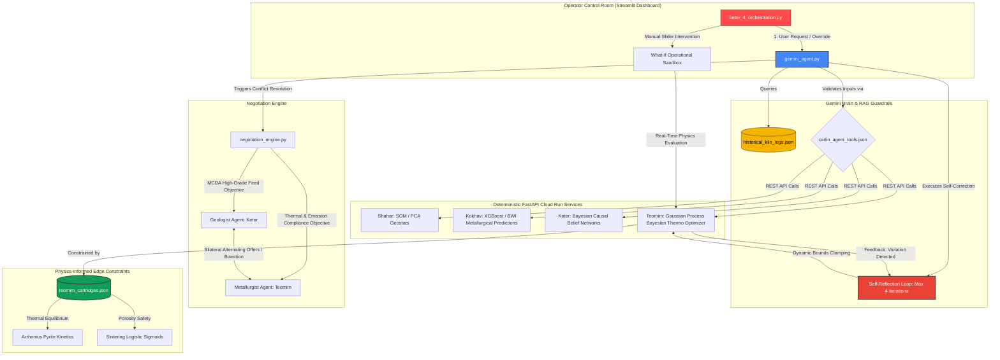

```mermaid
flowchart TD
    subgraph UI_Layer ["Operator Control Room (Streamlit Dashboard)"]
        UI["keter_4_orchestration.py"] -->|1. User Request / Override| AgentCore
        UI -->|Manual Slider Intervention| Sandbox["What-If Operational Sandbox"]
    end

    subgraph Cognitive_Orchestration ["Gemini Brain & RAG Guardrails"]
        AgentCore["gemini_agent.py"] -->|Queries| RAG[("historical_kiln_logs.json")]
        AgentCore -->|Validates Inputs via| Schema{"carlin_agent_tools.json"}
        AgentCore -->|Executes Self-Correction| Loop["Self-Reflection Loop: Max 4 Iterations"]
    end

    subgraph Multi_Agent_Game_Theory ["Negotiation Engine"]
        AgentCore -->|Triggers Conflict Resolution| NegEngine["negotiation_engine.py"]
        NegEngine -->|MCDA High-Grade Feed Objective| GeoAgent["Geologist Agent: Keter"]
        NegEngine -->|Thermal & Emission Compliance Objective| MetAgent["Metallurgist Agent: Teomim"]
        GeoAgent <-->|Bilateral Alternating Offers / Bisection| MetAgent
    end

    subgraph Microservices_Layer ["Deterministic FastAPI Cloud Run Services"]
        Schema -->|REST API Calls| Shahar["Shahar: SOM / PCA Geostats"]
        Schema -->|REST API Calls| Kokhav["Kokhav: XGBoost / BWI Metallurgical Predictions"]
        Schema -->|REST API Calls| KeterSvc["Keter: Bayesian Causal Belief Networks"]
        Schema -->|REST API Calls| Teomim["Teomim: Gaussian Process Bayesian Thermo Optimizer"]
    end

    subgraph Physics_Core ["Physics-Informed Edge Constraints"]
        Teomim -->|Constrained by| Cartridge[("teomim_cartridges.json")]
        Cartridge -->|Thermal Equilibrium| Arrhenius["Arrhenius Pyrite Kinetics"]
        Cartridge -->|Porosity Safety| SinterSigmoid["Sintering Logistic Sigmoids"]
    end

    %% Flow links
    Sandbox -->|Real-Time Physics Evaluation| Teomim
    Loop -->|Dynamic Bounds Clamping| Teomim
    Teomim -->|Feedback: Violation Detected| Loop

    %% Style Configurations
    style AgentCore fill:#4285F4,stroke:#333,stroke-width:2px,color:#fff
    style RAG fill:#F4B400,stroke:#333,stroke-width:1px,color:#000
    style Loop fill:#EA4335,stroke:#333,stroke-width:2px,color:#fff
    style Cartridge fill:#0F9D58,stroke:#333,stroke-width:2px,color:#fff
    style UI fill:#FF4B4B,stroke:#333,stroke-width:1px,color:#fff
```
