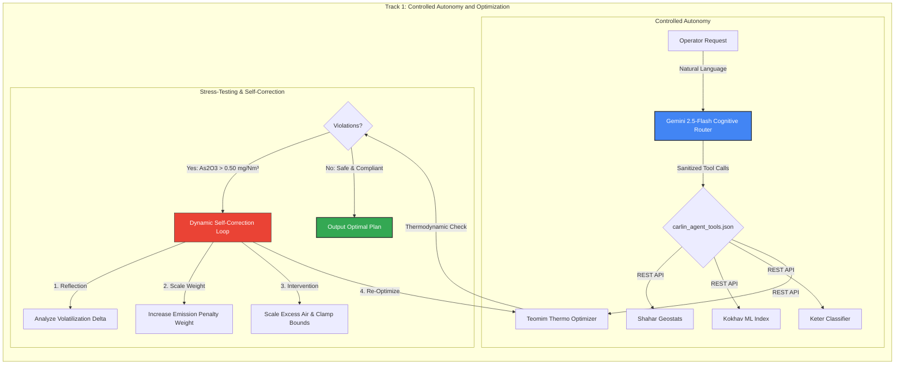

[README.md](https://github.com/user-attachments/files/28750822/README.md)
<p align="center">
  <h1 align="center"> Autonomous Geo-Metallurgical Orchestration Pipeline</h1>
  <p align="center">
    <strong>Google for Startups AI Agents Challenge 2026 Submission</strong>
  </p>
  <p align="center">
    <em>Controlled Autonomy & Physics-Constrained Self-Correction for Double-Refractory Gold Ore Processing</em>
  </p>
  <p align="center">
    
    
    
    
    
  </p>
</p>

---

## 1. Overview & Industrial Context

This agent was built as a part of our pipeline to help solve one of the most mathematically and physically complex challenges in heavy industry: processing Nevada Carlin-type double-refractory gold ores.

### The Industrial Challenge
In Carlin-type gold deposits, microscopic gold is trapped inside the crystal lattices of arsenopyrite (refractory pyrite) and masked by organic carbon (which absorbs dissolved gold during processing, a phenomenon known as "preg-robbing"). 
To recover the gold, the ore must be roasted at high temperatures. However:
* **Overheating (>700°C)** triggers clay sintering, collapsing the ore's microscopic pores and permanently trapping the gold.
* **Under-heating or improper oxygen levels** leads to incomplete sulfur combustion and causes hazardous volatile arsenic ($\text{As}_2\text{O}_3$) to escape the stack, violating strict EPA Title V and NDEP environmental regulations.
* **Operation Silos**: Historically, geologists (who optimize feed grade) and metallurgists (who protect the kiln and maintain compliance) operate in disconnected silos with slow, manual handoffs.

### The Proposed Solution
We eliminate this operational divide by using a central cognitive coordinator—powered by **Google Gemini 2.5-Flash** to orchestrate a multi-agent negotiation engine and guide four specialized, deterministic microservices. It automatically optimizes the feed blend, roaster temperature, and gas flows to maximize gold recovery while guaranteeing absolute environmental and physical safety.

---

## 2. Hackathon Track Alignment

The agent was built from the ground up to showcase the core principles of Google's agentic ecosystem across this specific track:



### Build (Controlled Autonomy)
Industrial physical infrastructure requires absolute safety guarantees. An open-ended conversational LLM cannot be trusted to run chemical equations or directly control a roasting kiln. 
* **The Cognitive Router**: Gemini 2.5-Flash acts as the system's brain—parsing operator commands, extracting geological contexts, executing RAG checks, and translating multi-agent bargaining into human-readable logs.
* **Deterministic microservices**: The heavy mathematical and physical lifting is delegated to dedicated, isolated Python microservices via a strictly defined API contract. This ensures that every recommendation is physically grounded and mathematically verified.

### Optimize (Under-the-Hood Self-Correction)
Real-world industrial feeds are highly volatile. When high-arsenic or high-carbon feeds trigger safety violations during a simulation run, the agent must not stall, hallucinate, or crash.
* **Self-Reflection Protocol**: The agent implements an automated self-correction loop (max 4 iterations). If Teomim reports emissions exceeding the NDEP Title V limit ($>0.50 \text{ mg/Nm}^3$) or sintering risk ($>15\%$), the agent:
  1. Identifies the specific constraint violation.
  2. Increases the Multi-Criteria Decision Analysis (MCDA) penalty weights for that constraint.
  3. Scales the physical control baseline (e.g., boosting excess combustion air to chemically bind arsenic into stable iron arsenate $\text{FeAsO}_4$).
  4. Dynamically clamps the search bounds of the Bayesian optimizer:
     `Excess_Air_Lower_Bound = max(default_lower, baseline + scaled_delta)`
  5. Triggers a new 50-iteration Bayesian search sweep, forcing the optimizer to converge within a physically safe operational envelope.

---

## 3. Hackathon Project Core Files

The core files implementing the agentic logic, tools, and validation suite are located at the following paths:

| File Name | Purpose & Hackathon Role |
| :--- | :--- |
| **gemini_agent.py** | **The Central Brain**: Sets up the Gemini client, handles tool-calling loops, manages chat memory state, and runs the self-correction protocol. |
| **negotiation_engine.py** | **Bilateral Bargaining Engine**: Solves the geologist-metallurgist feed grade vs. kiln safety conflict using a deterministic Rubinstein game with alternating bisection concessions. |
| **prompts.py** | **System Instructions**: System instruction templates and context builders that ground Gemini in geological classifications and MCDA utilities. |
| **test_gemini_agent_new.py** | **Verification Suite**: Integration tests that programmatically verify the RAG system, self-correction triggers, dynamic bounds clamping, and negotiation convergence. |
| **keter_4_orchestration.py** | **Operator UI**: Glassmorphic dashboard rendering the interactive Causal DAG (PyVis), the "What-If" sandbox, and the step-by-step negotiation transcript. |
| **historical_kiln_logs.json** | **RAG Safety Guardrails**: Database storing past kiln failure logs, sintering collapses, and root-cause analyses used to ground the agent before optimizations. |
| **carlin_agent_tools.json** | **Sanitized Tool Specs**: OpenAPI-style JSON schema defining the FastAPI endpoint contracts, tool parameters, and parameter boundaries for the agent. |
| **teomim_cartridges.json** | **Surrogate Physical Models**: Physics parameters (Arrhenius coefficients, sintering activation energies, and EPA thresholds) that constrain the roaster optimizer. |
| **config_keter.yaml** | **Global Settings**: Configuration settings defining FastAPI service routing endpoints, RAG file paths, and default optimization iterations. |

---

## 4. Detailed Architecture & Technical Deep-Dive

The pipeline distributes its intelligence across five layers: the Gemini Orchestrator, RAG Guardrails, a Game-Theoretic Negotiation Engine, a Physics-Informed surrogate, and a Bayesian Optimizer.

### 4.1 Physics-Informed AI (`teomim_cartridges.json`)
To prevent the agent from hallucinating unphysical temperatures or recoveries, Keter embeds strict thermodynamic laws in isolated Python modules:
* **Arrhenius Kinetics & Combustion Heating**: Models sulfide oxidation ($4\text{FeS}_2 + 11\text{O}_2 \rightarrow 2\text{Fe}_2\text{O}_3 + 8\text{SO}_2$), computing the exact exothermic heat generated per ton of sulfide feed.
* **Sintering Sigmoids**: Clay phase transition at 700°C is modeled as a logistic sigmoid:
  $$P_{\text{sinter}} = \frac{1}{1 + \exp(-k_{\text{sinter}} \cdot (T - T_{\text{crit}}))}$$
  This creates a hard mathematical "wall" that forces the optimizer to restrict temperature to protect calcine porosity.

### 4.2 Game-Theoretic Multi-Agent Negotiation (`negotiation_engine.py`)
Grade maximization directly conflicts with roaster environmental compliance. Rather than using brittle prompt-based arguments, Keter models this as a bilateral **Rubinstein alternating-offers bargaining game**:
* **The Geologist Agent (Keter)**: Optimizes a Multi-Criteria Decision Analysis (MCDA) utility function targeting high feed grade ($Au$) and manageable grinding hardness:
  $$U_{\text{geo}} = w_{\text{au}} \cdot u(Au) + w_{\text{bwi}} \cdot u(BWI)$$
* **The Metallurgist Agent (Teomim)**: Optimizes a utility function targeting roaster recovery while penalizing sintering and emission violations:
  $$U_{\text{met}} = R_{\text{roast}} - w_{\text{sinter}} \cdot P_{\text{sinter}} - w_{\text{emit}} \cdot P_{\text{emit}}$$
* **Bisection Concession Algorithm**: The engine adjusts the blend ratio back and forth using a bisection search. If a deadlock occurs, the agents make concession steps (relaxing target grades or increasing excess combustion air) until a stable Nash equilibrium is reached.

### 4.3 RAG Guardrails (`historical_kiln_logs.json`)
Before executing any optimization, the Gemini agent queries `historical_kiln_logs.json`. If the incoming ore matches historical failure signatures (such as `high_carbon` causing localized temperature spikes), the agent retrieves the corrective action (e.g., "maintain minimum excess air above 25%") and injects it as a hard constraint before beginning the roaster optimization.

---

## 5. Microservices & 7-Step Pipeline

The pipeline is built on four async FastAPI services co-hosted on Google Cloud Run:

| Service | Primary Algorithms & Math |
| :--- | :--- |
| **Shahar** | Self-Organizing Maps (SOM), k-Means clustering, PCA, Isometric Log-Ratio (ILR) composition transforms. |
| **Kokhav** | XGBoost regression predicting Bond Work Index (BWI) and baseline flotation recovery. |
| **Keter** | Bayesian Causal Belief Networks, Pearl's Causal Do-Calculus, ore classification. |
| **Teomim** | Bayesian Global Optimization using Gaussian Process (GP) surrogates with Expected Improvement (EI). |

### The 7-Step Closed-Loop Pipeline

```
[Step 1: Ingest Assays] ──> [Step 2: Compare Clusters] ──> [Step 3: Compute Centroid]
                                                                  │
                                                                  ▼
[Step 6: Handshake Constraints] <── [Step 5: Causal Classify] <── [Step 4: Predict ML Index]
       │
       ▼
[Step 7: Bayesian Roaster Optimization]
```

1. **Ingest Exploration Assays**: Raw assay CSV files (gold grade, sulfide sulfur, carbonate, organic carbon, and arsenic etc.) are uploaded to Shahar.
2. **Train Geochemical Clusters**: Shahar trains SOM and k-Means models, selecting the model with the highest Silhouette score.
3. **Compute Centroid**: Shahar computes the geochemical centroid of the winning ore cluster.
4. **Predict ML Index**: Kokhav runs the centroid through XGBoost to predict the grinding hardness (BWI) and baseline recovery.
5. **Causal Classification**: Keter maps the geochemical profile to an ore subtype (e.g., `refractory_pyrite`) using a Bayesian network.
6. **Handshake Constraints**: The classified ore subtype activates specific thermodynamic and environmental nodes in the Teomim roaster simulator.
7. **Bayesian Roaster Optimization**: Teomim runs a Bayesian optimization sweep to find the exact air flow, temperature, and quench rates that maximize recovery while maintaining safe sulfur emissions and preventing sintering.

---

## 6. Interactive Dashboard & UI Walkthrough

The operator interacts with Keter through a glassmorphic Streamlit Control Dashboard:
* **Interactive Causal DAG (PyVis)**: A dynamic, draggable Bayesian network showing the causal relationships between geological fingerprints, ore classifications, and recovery.
* **The "What-If" Sandbox**: Allows operators to manually override the agent's recommended feed rates or air flows. The Teomim physics engine runs in real-time, triggering alarms if a manual adjustment risks sintering or environmental violations.
* **Negotiation Transcript**: A rendered, turn-by-turn log showing the mathematical tradeoffs and compromises agreed upon by the Geologist and Metallurgist agents.

---

## 7. Setup & Installation

### 7.1 Environment Setup
Keter requires Python 3.9+. Install dependencies using conda:
```bash
# Clone the repository
git clone https://github.com/Sasha-Roslin/khalomot
cd khalomot

# Create virtual environment
conda create -n khalomot python=3.9 -y
conda activate khalomot

# Install required packages
pip install -r api/requirements_api.txt
```

### 7.2 API Credentials Config
Create a file named `keys.json` in the project root:
```json
{
  "KETER_API_KEY": "demo",
  "KOKHAV_API_KEY": "demo",
  "SHAHAR_API_KEY": "demo",
  "LAHAV_API_KEY": "demo"
}
```

Add your Gemini API Key (restricted demo key) to a `.env` file in the project root:
```env
GOOGLE_API_KEY=YOUR_DEMO_KEY_HERE
```

---

## 8. Verification & Local Testing

The project contains a comprehensive verification test suite that programmatically exercises all multi-agent features, RAG checks, and physics simulations:

```bash
# Run the test suite
python -m pytest -s test_gemini_agent_new.py
```

---

## 9. GCP Cloud Run Deployment

The whole platform is deployed as a series of containerized microservices on Google Cloud Run.


### Live URLs
* **FastAPI API Backend**: [https://keter-api-518450245106.us-central1.run.app](https://keter-api-518450245106.us-central1.run.app)
* **Streamlit Operator Dashboard**: [https://keter-streamlit-518450245106.us-central1.run.app](https://keter-streamlit-518450245106.us-central1.run.app)
